# 🔐 File encryption system 🔐


## 🛡️ Project overview

The project consists of a C++ application designed to provide file encryption and decryption functionality using the AES-256 algorithm.
It features a graphical interface built with the Slint framework.

## 🛠 Tech stack

- **Programming languages**: C++ and Slint.
- **GUI framework**: Slint.
- **Build system**: CMake.
- **Testing framework**: GoogleTest.

## 💻 Minimal and optimal system requirements

### Minimal system requirements

- **Operating system**: Ubuntu 18.04 (LTS) or newer
- **Architecture**: amd64
- **Processor**: 64-bit, 1GHz or faster
- **Memory**: 512 MB RAM
- **Storage**: 500 MB available space
- **Dependency**: OpenSSL 1.1.1 or newer

### Optimal system requirements

- **Operating system**: Ubuntu 22.04 (LTS) or newer
- **Architecture**: amd64
- **Processor**: dual-core 2 GHz or faster
- **Memory**: 1 GB RAM
- **Storage**: 1 GB available space
- **Dependency**: latest stable version of OpenSSL available for the OS

## ⚙️ Build from source

### 🔧 Prerequisites

Ensure you have the following installed on your system:

- build tools (`sudo apt install build-essential`)
- CMake (`sudo apt install cmake`)
- Git (`sudo apt install git`)

### Step 1: Clone the repository

Clone the project from GitHub:

```bash
git clone https://github.com/Braun-Alex/file-encryption-system.git
cd file-encryption-system # /file-encryption-system
```

### Step 2: Build the project

```bash
mkdir build
cmake -S . -DCMAKE_BUILD_TYPE=Release -DBUILD_SHARED_LIBS=OFF -DSLINT_STYLE=material -B build
cmake --build build
```

### Step 3: Run the tests

```bash
cd build # /file-encryption-system/build
ctest --output-on-failure
```

### Step 4: Run the application

```bash
cd bin # /file-encryption-system/build/bin
./file-encryption-system
```

## 📌 Screenshots

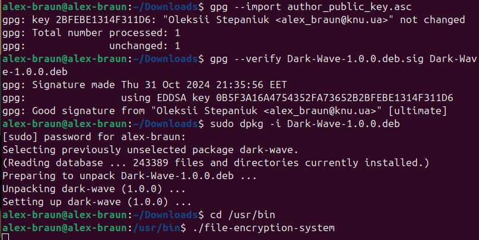
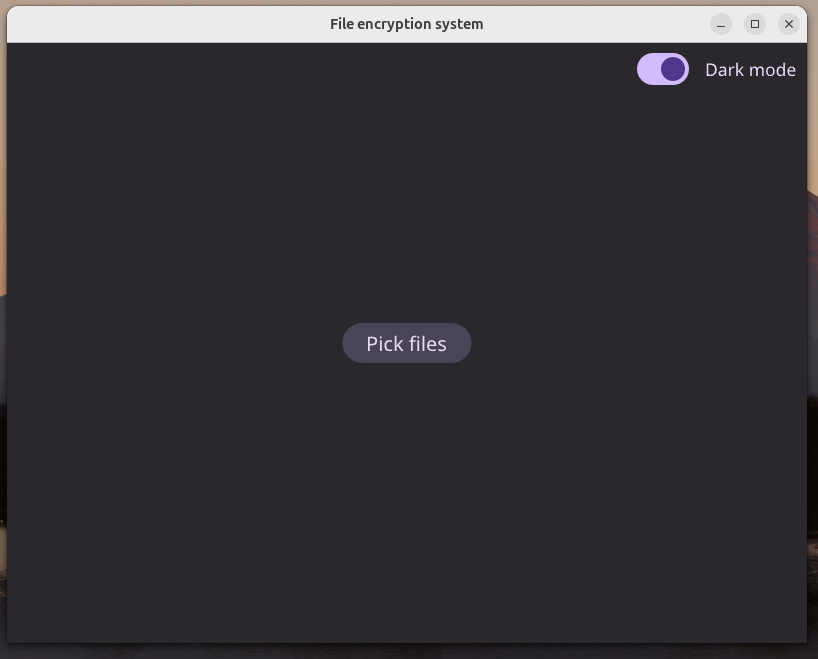
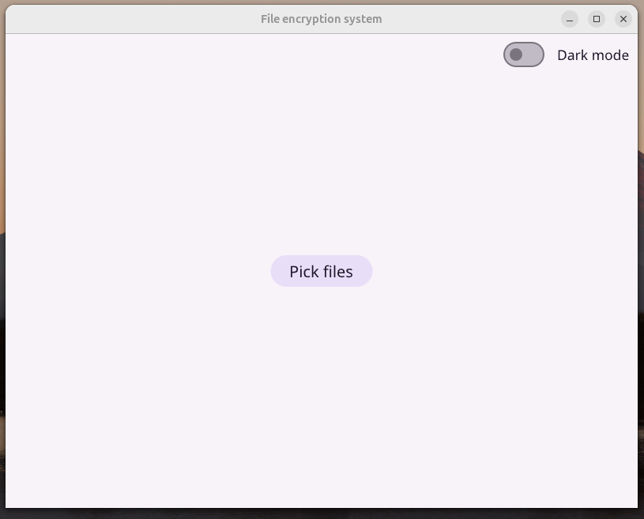
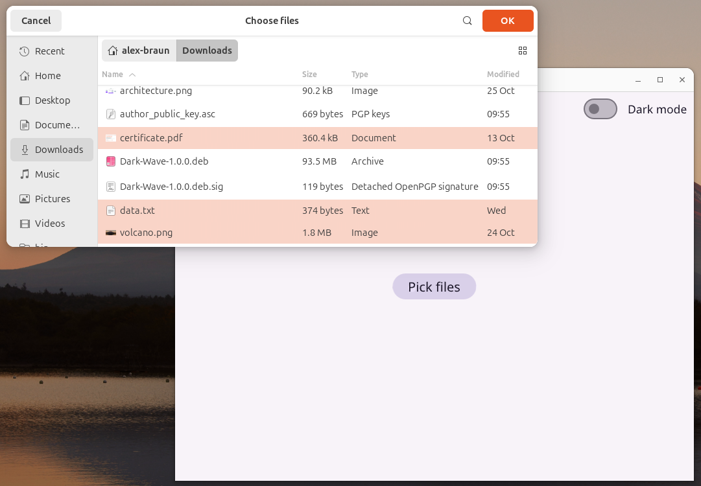
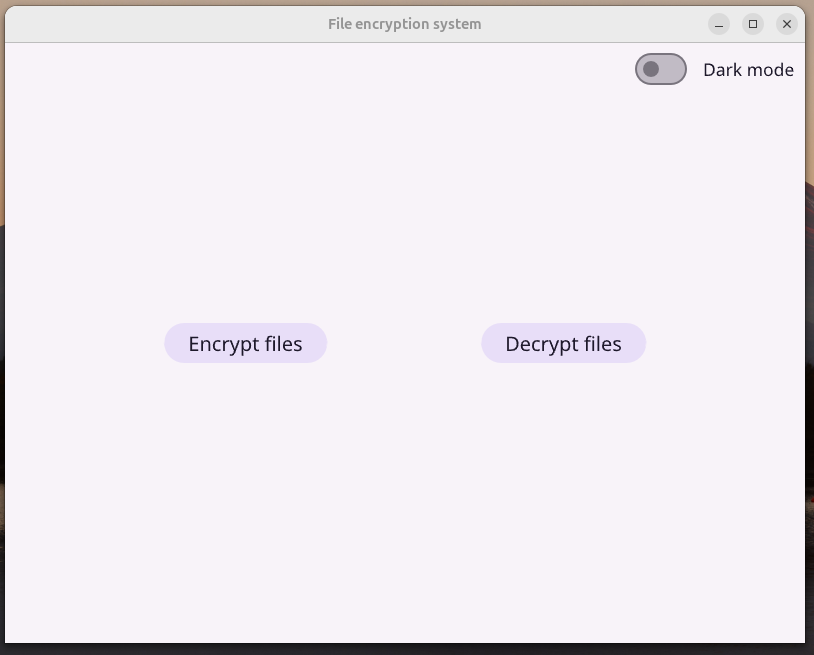
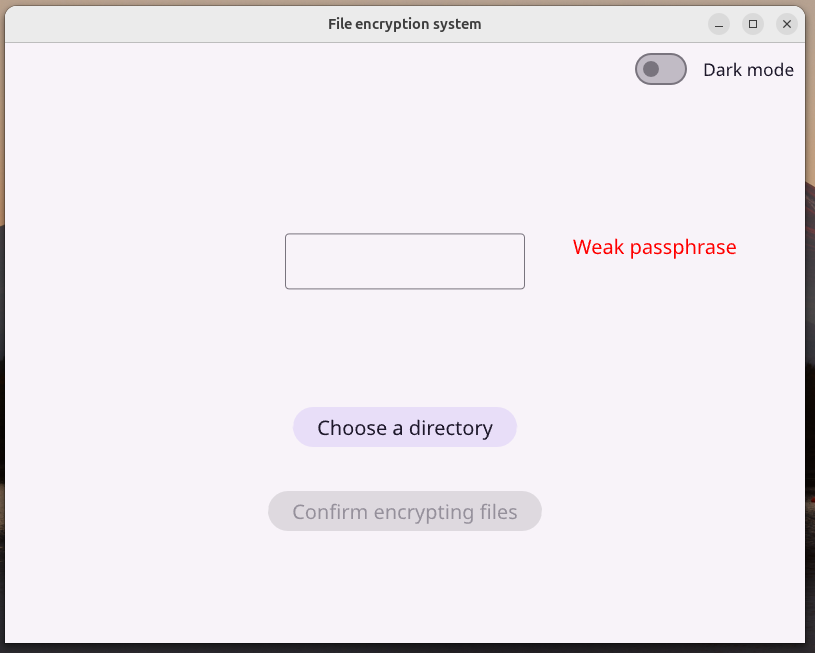
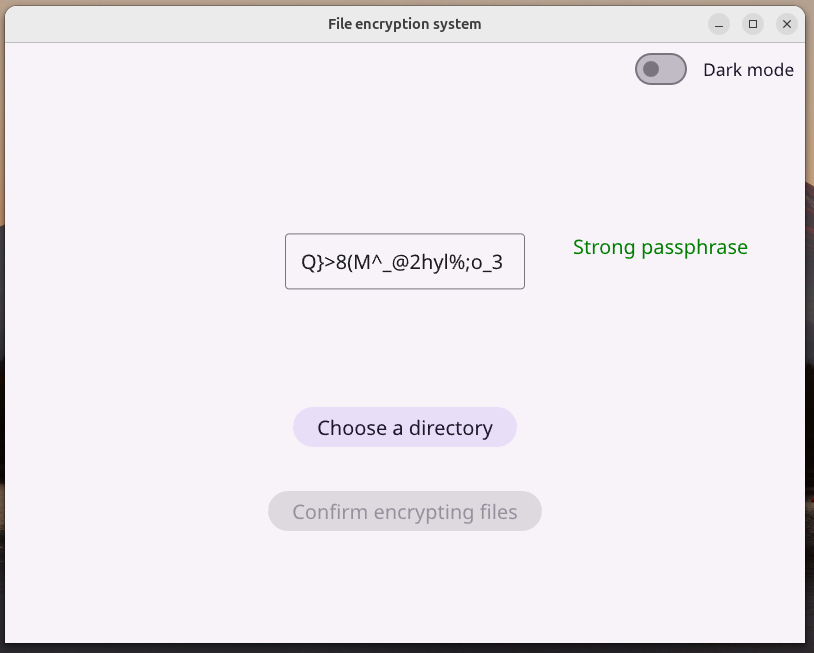
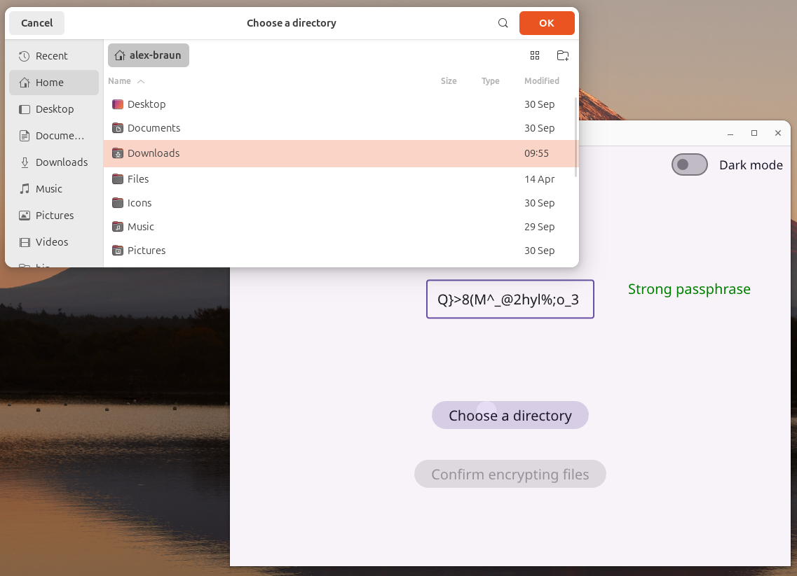
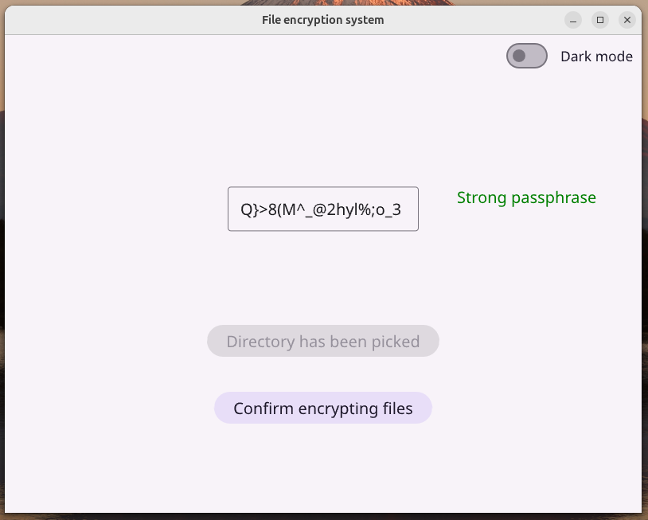
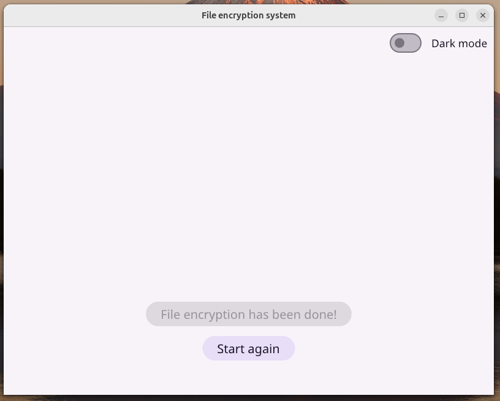
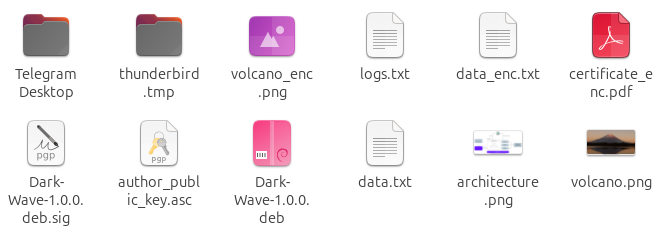
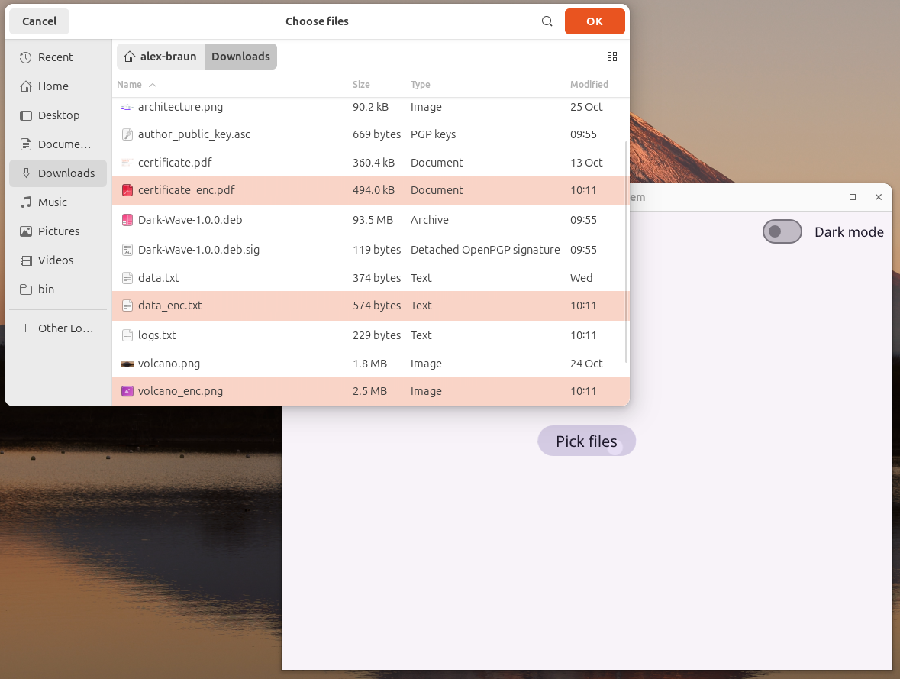
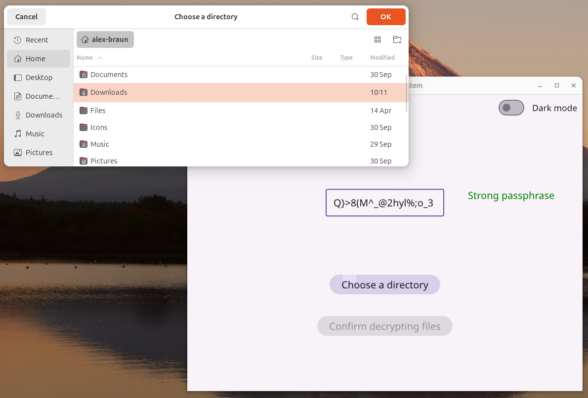
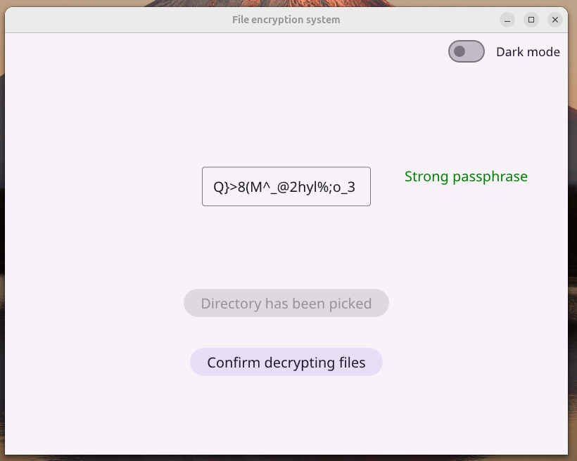
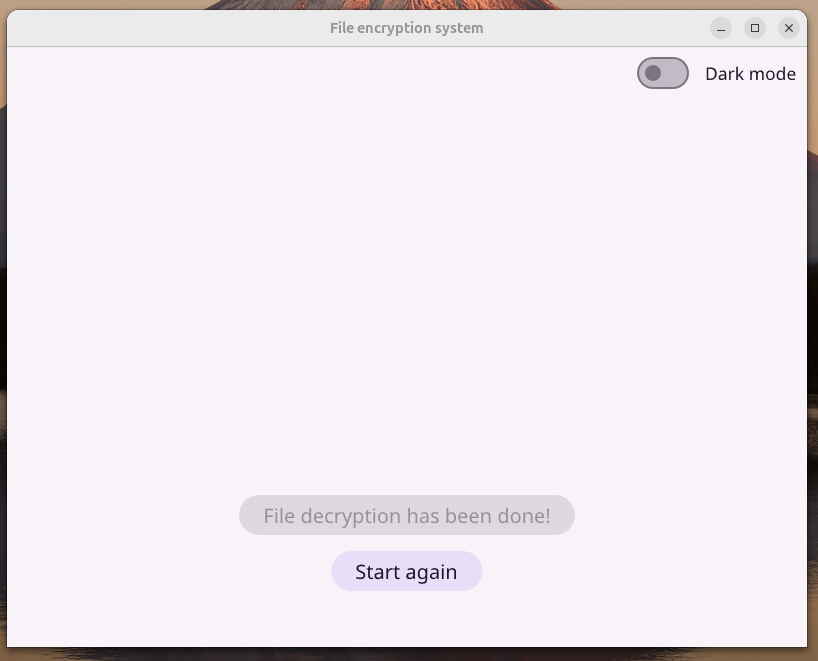
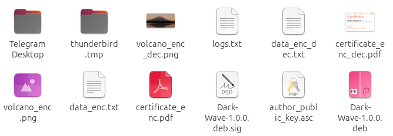

## ⚠️ Important notes

- Ensure that the 🔑 AES encryption keys 🔑 are kept secure and private. Never keep them together with encrypted files, as this can lead to data
  compromise.
- When encrypting files, verify that the 🔗 selected file paths 🔗 are correct to avoid accidental data loss.
- Regularly create backups of important data to prevent loss in case of 🕵️‍♂️ failures or attacks 🕵️‍♂️.

## 📜 License

This project is licensed under the MIT License. See the [LICENSE](LICENSE) file 📝 for details.
